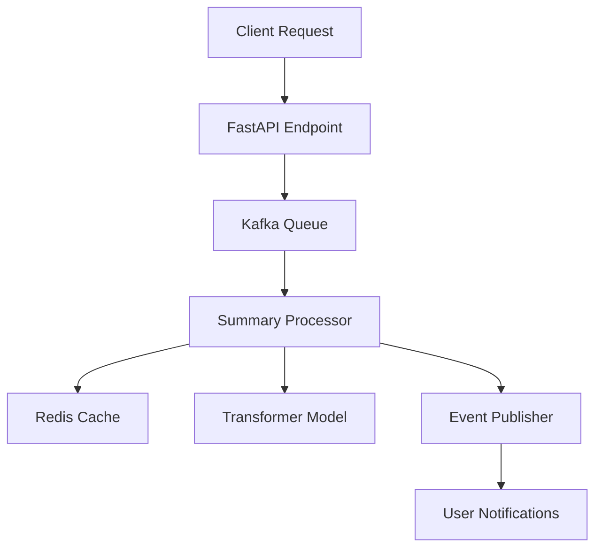

# Summarizer Microservice

A high-performance, scalable text summarization service built with FastAPI, Transformers, and Kafka for asynchronous processing.

## 🚀 Features

- ✨ AI-powered text summarization using state-of-the-art transformers
- 🚄 Asynchronous processing with Kafka message queue
- 💾 Redis caching for improved performance
- 🔄 Automatic chunk processing for long texts
- 📊 Detailed processing metrics and monitoring
- 🔒 Integration with Authentication service
- 🐋 Docker support for easy deployment

## 🏗️ Architecture



## 🛠️ Tech Stack

- **FastAPI**: Modern, fast web framework
- **Transformers**: Hugging Face's NLP models
- **Kafka**: Message queue for async processing
- **Redis**: Caching layer
- **Docker**: Containerization
- **Python 3.11+**: Latest Python features

## 📋 Prerequisites

- Python 3.11+
- Docker and Docker Compose
- Redis
- Kafka & Zookeeper
- GPU (optional, for faster processing)

## 🔧 Installation

1. **Clone the repository**
   ```bash
   git clone https://github.com/your-org/summarizer-service.git
   cd summarizer-service
   ```

2. **Set up environment variables**
   ```bash
   cp .env.example .env
   ```
   Edit `.env` with your configurations:
   ```env
   # Service Configuration
   PROJECT_NAME=Summarizer Service
   VERSION=1.0.0
   HOST=0.0.0.0
   PORT=8002

   # Model Settings
   MODEL_NAME=sshleifer/distilbart-cnn-12-6
   MAX_CHUNK_SIZE=800
   CHUNK_OVERLAP=100
   
   # Kafka Configuration
   KAFKA_SERVERS=localhost:9092
   
   # Redis Configuration
   REDIS_URL=redis://localhost:6379
   CACHE_TTL=3600
   
   # Processing Settings
   MAX_QUEUE_SIZE=10
   ```

3. **Using Docker (Recommended)**
   ```bash
   docker-compose up -d
   ```

4. **Local Development Setup**
   ```bash
   # Create virtual environment
   python -m venv venv
   source venv/bin/activate  # On Windows: .\venv\Scripts\activate

   # Install dependencies
   pip install -r requirements.txt
   pip install -r requirements-dev.txt  # For development

   # Start the service
   uvicorn app.main:app --reload
   ```

## 🚀 Usage

### API Endpoints

```plaintext
POST /api/v1/summarize
- Request body:
  {
    "content": "Text to summarize...",
    "max_length": 1024,  # optional
    "min_length": 50     # optional
  }
- Response:
  {
    "request_id": "uuid",
    "status": "processing"
  }

GET /api/v1/summary/{request_id}
- Response:
  {
    "summary": "Summarized text...",
    "processing_time": 1.23,
    "chunks_processed": 3
  }
```

### Example Usage

```python
import requests

# Request a summary
response = requests.post(
    "http://localhost:8002/api/v1/summarize",
    json={
        "content": "Long text to summarize...",
        "max_length": 1024
    }
)
request_id = response.json()["request_id"]

# Check summary status
summary = requests.get(f"http://localhost:8002/api/v1/summary/{request_id}")
print(summary.json()["summary"])
```

## 🔍 Monitoring

The service exposes several monitoring endpoints:

```plaintext
/metrics - Prometheus metrics
/health - Service health check
/docs - OpenAPI documentation
```

Key metrics:
- Processing time per request
- Cache hit ratio
- Queue length
- Error rates
- Model performance

## 🎯 Performance Tuning

1. **Caching Configuration**
   ```python
   CACHE_TTL=3600  # Cache lifetime in seconds
   ```

2. **Chunk Processing**
   ```python
   MAX_CHUNK_SIZE=800    # Maximum tokens per chunk
   CHUNK_OVERLAP=100     # Overlap between chunks
   ```

3. **Queue Management**
   ```python
   MAX_QUEUE_SIZE=10     # Maximum concurrent processing
   ```

## 🧪 Testing

```bash
# Run unit tests
pytest

# Run with coverage
pytest --cov=app tests/

# Run integration tests
pytest tests/integration/

# Run performance tests
pytest tests/performance/
```

## 📦 Deployment

1. **Production Deployment**
   ```bash
   docker-compose -f docker-compose.prod.yml up -d
   ```

2. **Scaling Services**
   ```bash
   docker-compose up -d --scale summarizer=3
   ```

## 🔒 Security

- Input validation and sanitization
- Rate limiting
- Token-based authentication
- Request size limits
- Error message sanitization

## 🤝 Contributing

1. Fork the repository
2. Create your feature branch (`git checkout -b feature/AmazingFeature`)
3. Commit your changes (`git commit -m 'Add some AmazingFeature'`)
4. Push to the branch (`git push origin feature/AmazingFeature`)
5. Open a Pull Request
